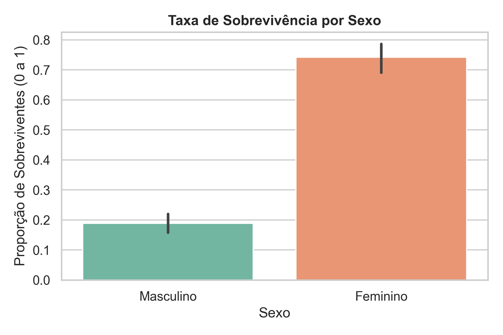
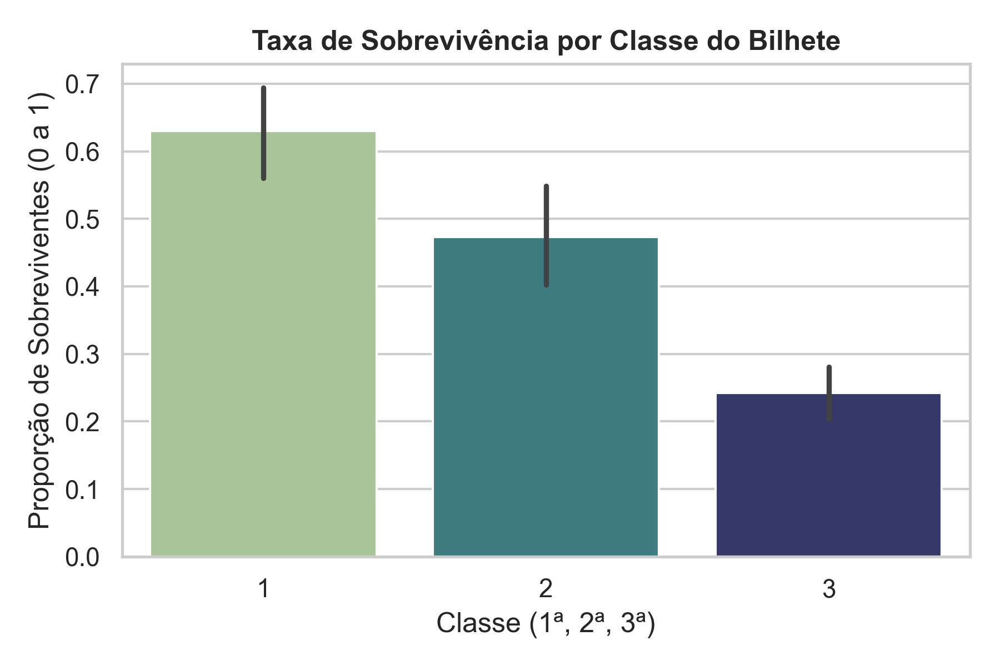
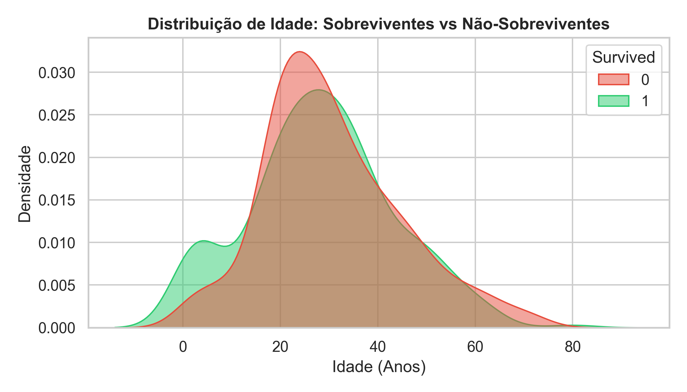
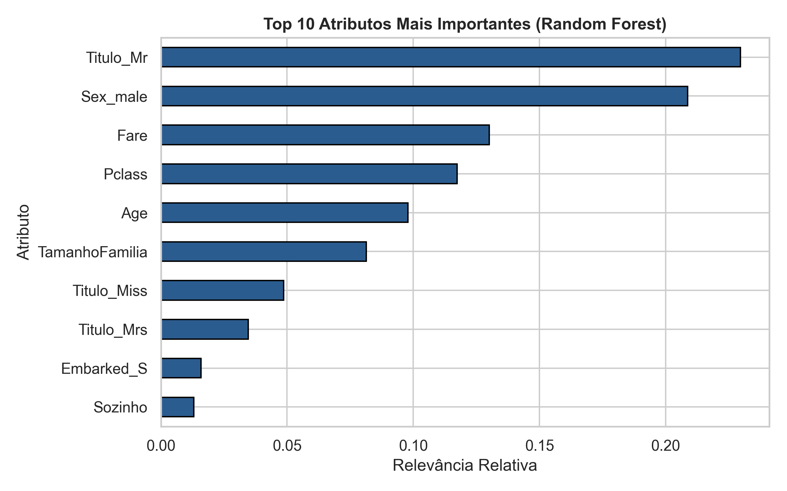

<div align="center">

# 🚢 Titanic ML - Meu Projeto de Aprendizado em Machine Learning
### *Estudo prático de Análise Exploratória, Pré-processamento e Algoritmos de Classificação*

[](https://www.python.org/)
[](https://pandas.pydata.org/)
[](https://scikit-learn.org/)
[](https://www.kaggle.com/c/titanic)

</div>

---

## 📌 Sobre o Projeto

Este repositório registra os meus estudos práticos em **Machine Learning (Aprendizado de Máquina)** utilizando o famoso desafio do Kaggle: **[Titanic - Machine Learning from Disaster](https://www.kaggle.com/c/titanic)**.

O objetivo do projeto é construir um modelo preditivo capaz de responder à pergunta: *"Quais passageiros tiveram mais chances de sobreviver ao naufrágio do Titanic?"*, utilizando dados como idade, sexo, classe do bilhete, valor da tarifa e tamanho da família.

---

## 🧠 Conceitos e Técnicas Aprendidas

Ao longo do desenvolvimento deste projeto, estudei e apliquei os seguintes fundamentos de Ciência de Dados:

- 🔍 **Análise Exploratória de Dados (EDA)**: Compreensão da distribuição das variáveis e identificação de padrões de sobrevivência.
- 🧹 **Tratamento de Dados Faltantes**: Imputação de idades nulas usando a mediana baseada no título de cortesia (*Mr, Mrs, Miss, Master*).
- ⚙️ **Engenharia de Atributos (Feature Engineering)**: Criação das colunas `TamanhoFamilia` e `Sozinho` a partir de parentes a bordo.
- 🤖 **Modelos de Classificação**: Estudo e comparação de algoritmos (Regressão Logística, Árvore de Decisão, Random Forest e XGBoost).
- 📐 **Validação Cruzada (Cross-Validation)**: Avaliação robusta usando *Stratified 5-Fold CV* para evitar *overfitting*.

---

## 📊 Principais Insights dos Dados

A Análise Exploratória revelou fatores socioeconômicos e demográficos determinantes no resgate:

1. **Prioridade para Mulheres**: A taxa de sobrevivência das mulheres foi de **~74%**, enquanto a dos homens foi de apenas **~18%**.
2. **Classe Socioeconômica**: Passageiros da **1ª Classe** tiveram ~**63%** de sobrevivência, contra **24%** dos passageiros da **3ª Classe**.
3. **Efeito do Título**: Passageiros com título de criança (*Master*) ou mulheres (*Miss/Mrs*) tiveram maior probabilidade de resgate.

### 📷 Gráficos da Análise

<div align="center">

| Sobrevivência por Sexo | Sobrevivência por Classe | Distribuição de Idade |
|:---:|:---:|:---:|
|  |  |  |

</div>

---

## 🤖 Comparação de Modelos

Os modelos foram avaliados pela metric **Acurácia Média** obtida na Validação Cruzada (5 Folds):

| Algoritmo | Acurácia Média (CV) | Desvio Padrão | Observação |
|---|:---:|:---:|---|
| 🥇 **Random Forest** | **83.50%** | ± 0.86% | **Melhor desempenho geral** (combinação de várias árvores de decisão). |
| 🥈 **XGBoost** | **83.28%** | ± 1.62% | Excelente modelo baseado em *Gradient Boosting*. |
| 🥉 **Árvore de Decisão** | **82.71%** | ± 1.77% | Modelo simples e altamente interpretável. |
| 🔹 **Regressão Logística** | **82.60%** | ± 0.78% | Modelo baseline linear, rápido e consistente. |

> **Gráfico de Importância de Atributos (Random Forest):**
>
> <div align="center">
> 
> 
> 
> </div>

---

## 📂 Estrutura do Repositório

```text
ML - Titanic/
├── data/
│   ├── train.csv                 # Dados de treino originais do Kaggle
│   └── test.csv                  # Dados de teste originais do Kaggle
├── notebooks/
│   ├── 01_analise_exploratoria.ipynb   # Análise visual e entendimento dos dados
│   └── 02_modelo_titanic.ipynb         # Construção e comparação dos modelos
├── src/
│   ├── processamento.py          # Limpeza de dados e criação de colunas
│   └── modelagem.py              # Treinamento e avaliação dos modelos
├── reports/
│   └── figuras/                  # Gráficos salvos em alta definição
├── submissions/
│   └── submission.csv            # Arquivo de submissão pronto para o Kaggle
├── main.py                       # Script principal que roda todo o projeto
├── requirements.txt              # Bibliotecas necessárias para rodar o código
└── README.md                     # Documentação do projeto
```

---

## 🚀 Como Executar o Projeto Localmente

### 1. Clonar o Repositório

```bash
git clone https://github.com/MykaQMS/titanic-ml-analysis.git
cd titanic-ml-analysis
```

### 2. Instalar as Bibliotecas Necessárias

```bash
pip install -r requirements.txt
```

### 3. Rodar o Pipeline Completo

Execute o arquivo `main.py` para realizar o pré-processamento, treinar os modelos e gerar a submissão para o Kaggle:

```bash
python main.py
```

---
*Desenvolvido por Mykael como parte da minha jornada de estudos em Machine Learning.* 🚀
